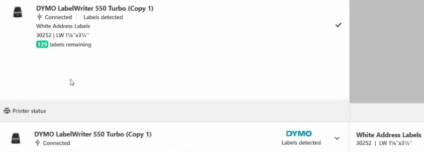
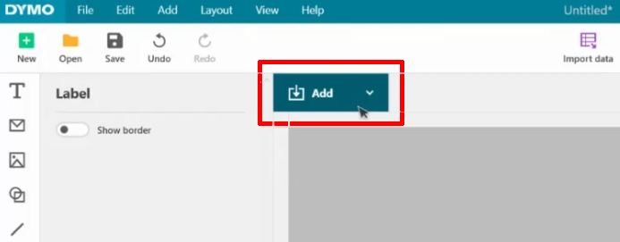
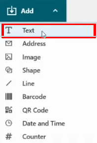
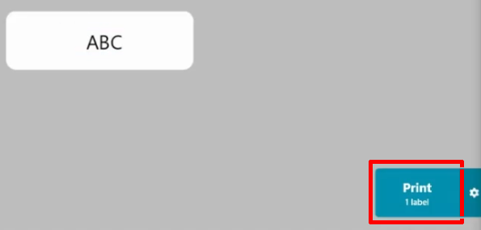
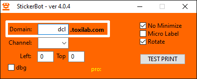
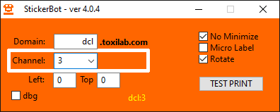
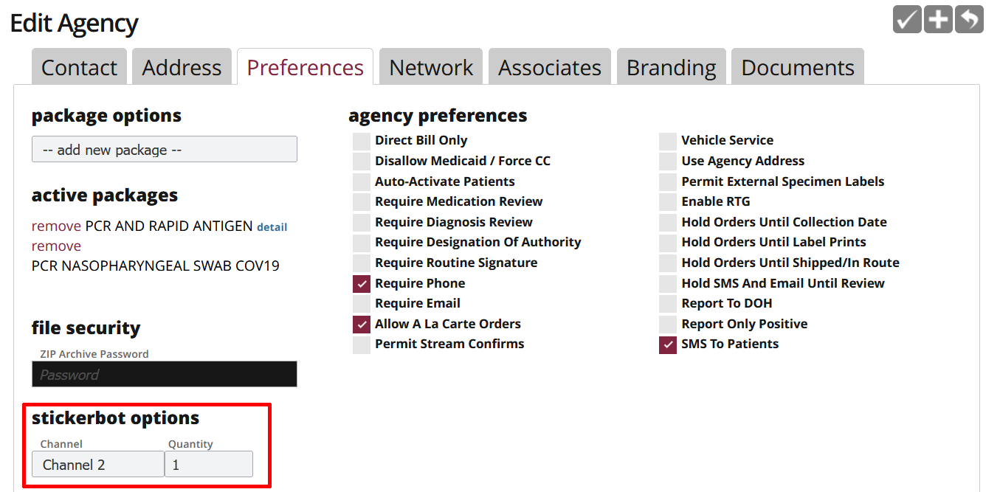
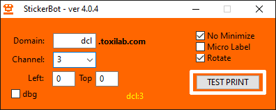

# Setting up your printer

This page describes how to set up your Dymo label printer.

!!! note
    For instructions on how to load labels, see the [Dymo LabelWriter user guide](https://download.dymo.com/dymo/user-guides/LabelWriter/LW450Series/UG/LabelWriter_UserGuide_en-US.pdf).

!!! note
    To view a list of recommended supplies, see [Supply Recommendations](https://docs.google.com/spreadsheets/d/103snpVjgD5z9Tvf8VhtTJZEpV36h8GTUKhGUDFX7sF8/edit#gid=0).

## Requirements

### System requirements

- Windows 10 or Windows 11

!!! warning
    Machines using Intel Atom processors are not compatible.

### Label printer

- Dymo LabelWriter 450
- Dymo LabelWriter 550

### Labels

- Required label size: ¾ x 2 return labels
- Dymo 450 printers are compatible with any brand of label.
- Dymo 550 printers can only be used with Dymo labels, specifically the 30330 labels: https://www.amazon.com/DYMO-Authentic-Address-LabelWriter-Printers/dp/B00004Z5W6

!!! note
    The Dymo 550 printer labels are more expensive than the generic labels that can be used with the Dymo 450, but the Dymo 450 has more limited stock than the Dymo 550. The cost of Dymo 550 labels is about two cents per label. You may decide to initially purchase Dymo 550 printers and obtain Dymo 450 printers whenever they become available for purchase.

## Installing Dymo Connect for Desktop (DCD)

Dymo's DCD software lets you create and print labels to your Dymo label printer. The following steps describe how to download DCD and confirm that your printer is compatible with your machine.

1. Download and install DCD version 1.4.2 or later from [Dymo's downloads page](https://www.dymo.com/support?cfid=user-guide).

2. After installing and opening DCD, connect your printer to your machine and confirm that the same printer can be selected in DCD.

    

3. You can confirm that your printer is compatible with your machine by printing a test label. To print a test label, refer to the following steps:

    1. Click the **Add** button.

        

    2. Select **Text** from the list of options.

        

    3. To send the test label to your printer, click **Print**.

        

## Installing StickerBot

The following steps describe how to download StickerBot and confirm that the machine connected to your printer is able to communicate with the Toxilab servers.

1. Download and install StickerBot version 4.0.4 from the [StickerBot downloads page](https://stickerbot.net/).

2. You can confirm that your machine is able to communicate with the Toxilab servers by performing a test print with StickerBot. To perform a test print, refer to the following steps:

    1. Open StickerBot.
    2. In the **Domain** box, make sure that `dcl` is entered.

        

    3. Next to **Channel**, select the channel that is associated with your testing location.

        

        !!! note
            To check that you have the correct channel number, refer to the following steps:

            1. In Toxilab, click **Management** -> **Agencies**.

            2. Select your testing location.

            3. Click **Preferences**. The channel number for your testing location is listed under **StickerBot options**.

            

    4. Click the **Test Print** button.

        
